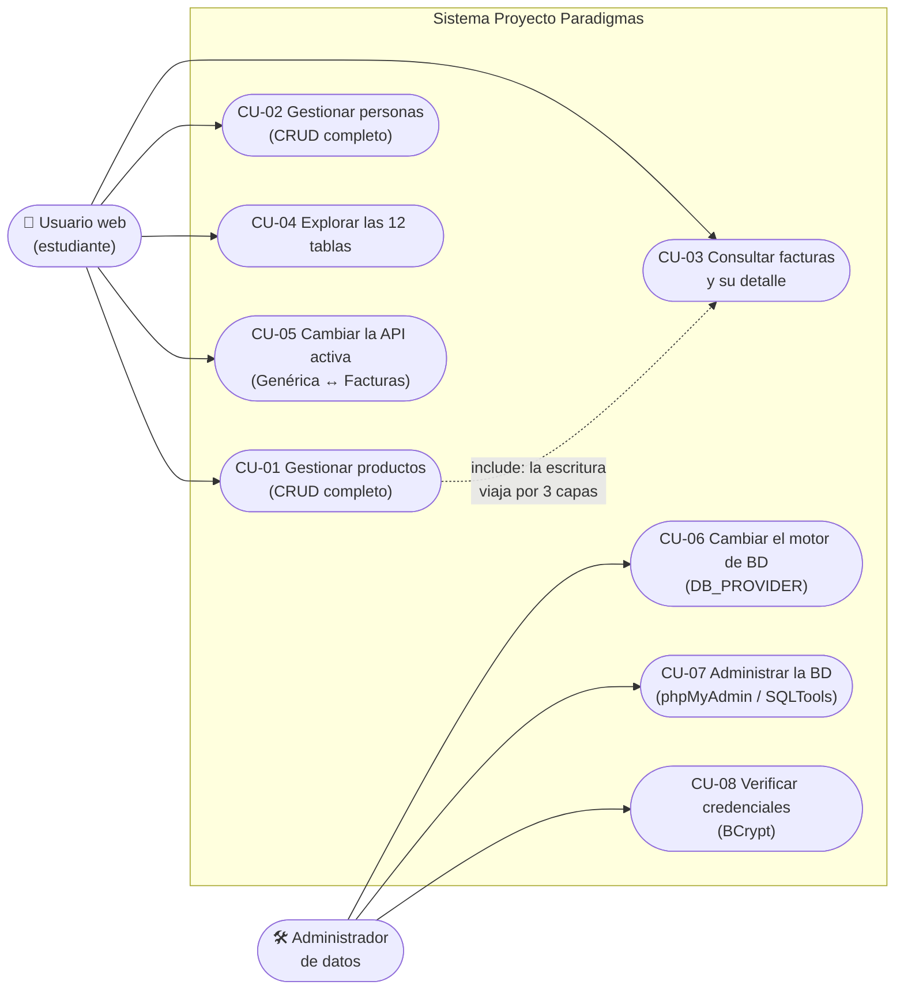
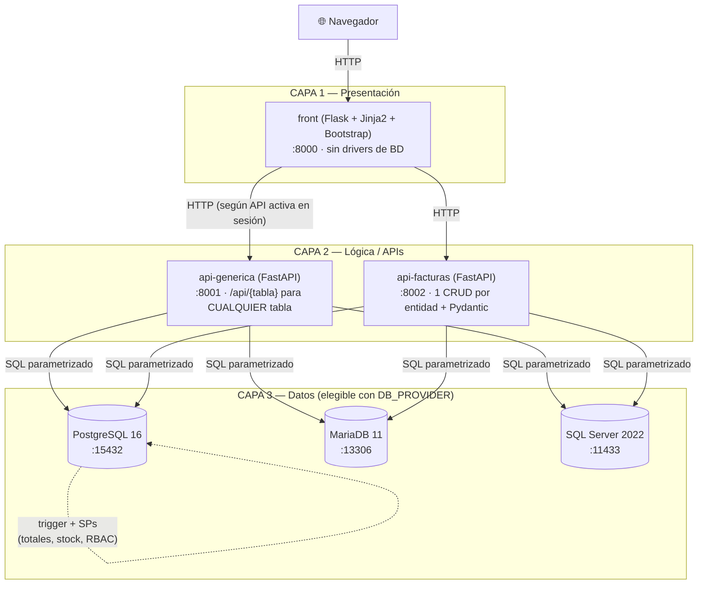
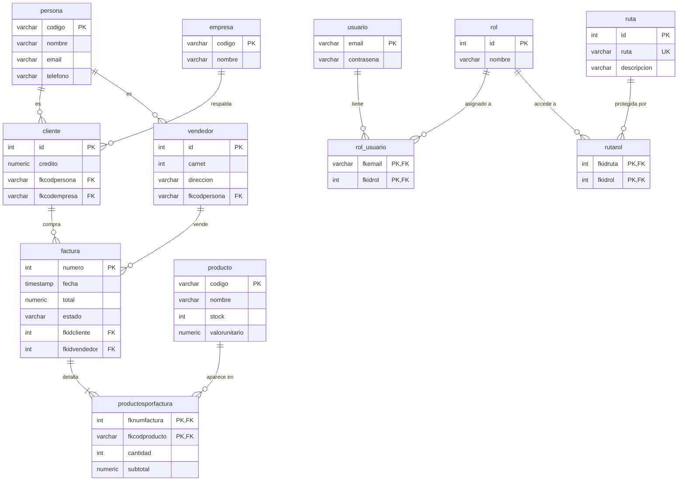
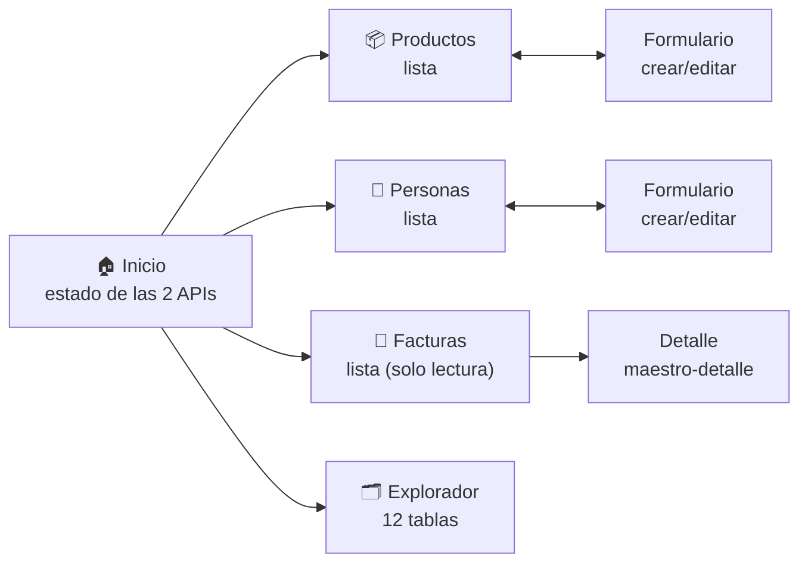
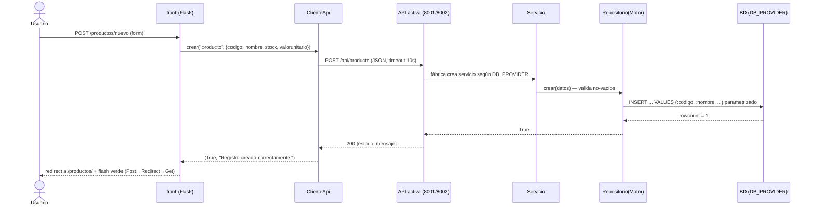
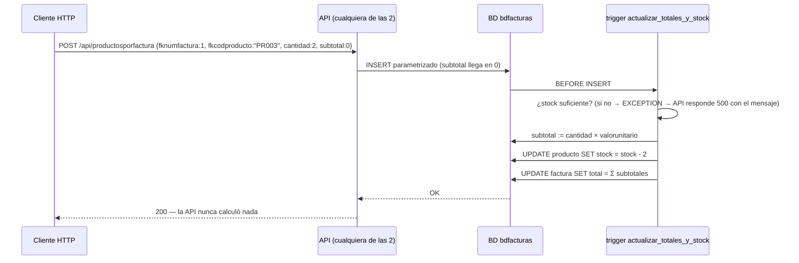
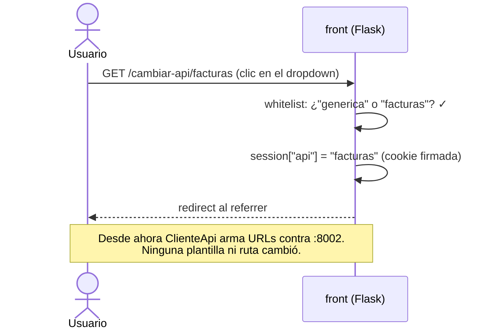
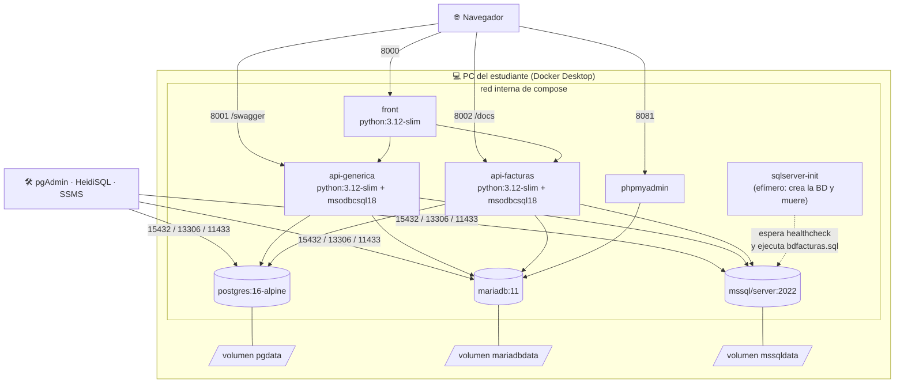

# Proyecto Paradigmas

Entorno de aprendizaje **todo-en-uno con Docker**: una arquitectura real de **3 capas** — frontend Flask, dos APIs FastAPI y tres motores de base de datos — que se levanta completa con **un solo comando**. Solo se necesita Docker Desktop.

```
Navegador → FRONT Flask (8000)
                ├── API GENÉRICA  (8001)  CRUD sobre cualquier tabla
                └── API FACTURAS  (8002)  CRUD por entidad + validación Pydantic
                        └── PostgreSQL · MariaDB · SQL Server  (bdfacturas)
```

> 📖 **Documentación:** [Guía del estudiante](docs/GUIA_ESTUDIANTE.md) · [Arquitectura de 3 capas](docs/ARQUITECTURA_3_CAPAS.md) · [Principios SOLID y ACID aplicados](docs/PRINCIPIOS_SOLID_ACID.md) · [Conceptos clave](docs/CONCEPTOS.md) · [Cómo se construyó el entorno](docs/TUTORIAL_CONSTRUCCION.md) · [SDD y Spec Kit](docs/SDD_SPECKIT.md)
>
> 📐 **Spec kits** (especificación + plan + tareas para reconstruir cada pieza desde cero):
> [Proyecto e infraestructura](docs/spec_kit/2_spec.md) (con la [constitución](docs/spec_kit/1_constitution.md)) ·
> [API Genérica](api_generica/docs/spec_kit/2_spec.md) ·
> [API Facturas](api_facturas/docs/spec_kit/2_spec.md) ·
> [Front Flask](front_flask/docs/spec_kit/2_spec.md)
>
> 🔢 **Trabajo por versiones** (desarrollo incremental guiado por especificaciones):
> [Mapa de versiones](docs/spec_kit/versiones/0_mapa_versiones.md) —
> empezando por la [v1: api_facturas con producto + PostgreSQL](docs/spec_kit/versiones/v1_producto_postgres/2_spec.md)

---

## Puesta en marcha (un solo comando)

En la terminal de VS Code:

```bash
git clone https://github.com/ccastro2050/proyecto_paradigmas.git
cd proyecto_paradigmas
docker compose up -d --build
```

**Eso es todo.** La primera vez tarda unos minutos (descarga las imágenes). Al terminar:

| Qué | Dónde |
|---|---|
| **Frontend** (Flask + Bootstrap) | http://localhost:8000 |
| **API Genérica** — Swagger | http://localhost:8001/swagger |
| **API Facturas** — Swagger | http://localhost:8002/docs |
| **phpMyAdmin** (admin web de MariaDB) | http://localhost:8081 |
| PostgreSQL 16 · MariaDB 11 · SQL Server 2022 | con la BD `bdfacturas` cargada |

Todo el código está **comentado en español** para quien está comenzando a programar.

---

## ¿Cambiaste el código? Así se actualiza Docker

El código de las apps está **montado como volumen** dentro de los contenedores (el front corre con `--debug` y las APIs con `--reload`), así que **la mayoría de los cambios no requieren ningún comando**:

| Qué cambiaste | Qué hay que hacer |
|---|---|
| Código Python o HTML (`front_flask/`, `api_generica/`, `api_facturas/`) | **Nada.** Guarda el archivo y recarga el navegador (F5) — el contenedor detecta el cambio solo. |
| `requirements.txt` o un `Dockerfile` (p. ej. una librería nueva) | `docker compose up -d --build` (reconstruye la imagen; puedes limitarlo: `docker compose up -d --build api-facturas`) |
| `docker-compose.yml` (puertos, variables, servicios) | `docker compose up -d` (recrea solo lo que cambió) |
| Scripts SQL de `db/` (tablas, triggers, datos iniciales) | `docker compose down -v` y luego `docker compose up -d` — ⚠️ **borra los datos** y recarga la BD desde cero |

Si un cambio no se refleja: `docker compose restart front` (o `api-generica` / `api-facturas`); en último caso, `docker compose up -d --build`.

---

## Estructura del proyecto

```
proyecto_paradigmas/
├── docker-compose.yml      # Toda la infraestructura declarada aquí
├── db/                     # Scripts de bdfacturas para los 3 motores
│
├── front_flask/            # CAPA 1 — Frontend (puerto 8000)
│   ├── rutas/              #   Blueprints: productos, personas, facturas, explorador
│   ├── servicios/          #   cliente_api.py: consume cualquiera de las 2 APIs
│   └── templates/          #   HTML con Bootstrap 5 (herencia Jinja2)
│
├── api_generica/           # CAPA 2a — API CRUD genérica (puerto 8001)
│   ├── controllers/        #   /api/{tabla} sirve para CUALQUIER tabla
│   ├── servicios/          #   ServicioCrud + Fábrica + BCrypt
│   └── repositorios/       #   PostgreSQL | MariaDB | SQL Server
│
├── api_facturas/           # CAPA 2b — API por entidad (puerto 8002)
│   ├── controllers/        #   Un controller por tabla (12 entidades)
│   ├── models/             #   Modelos Pydantic (validación estricta)
│   ├── servicios/          #   Lógica de negocio por entidad
│   └── repositorios/       #   Un repositorio por entidad y por motor
│
└── docs/                   # Guías y tutoriales
```

Las dos APIs siguen la misma arquitectura interna de sus repos originales:
[ApiGenericaFastApi_Crud](https://github.com/ccastro2050/ApiGenericaFastApi_Crud) y
[ApiFacturasFastApi_Crud](https://github.com/ccastro2050/ApiFacturasFastApi_Crud).

---

## Análisis

### Casos de uso más representativos



| CU | Flujo principal (resumen) | Regla clave |
|---|---|---|
| CU-01/02 | Listar → formulario → POST → flash → volver a la lista (Post→Redirect→Get) | El front nunca toca la BD: todo pasa por una API |
| CU-03 | Lista de facturas → detalle maestro-detalle | Totales y subtotales los calcula el **trigger** de la BD |
| CU-05 | Dropdown del navbar guarda `session["api"]` | Las pantallas funcionan idéntico con las dos APIs |
| CU-06 | `$env:DB_PROVIDER=...` + `docker compose up -d` | Cero cambios de código: es el punto del curso |

### Historias de usuario

| # | Historia | Criterios de aceptación |
|---|---|---|
| HU-01 | **Como** estudiante **quiero** crear, editar y eliminar productos desde el navegador **para** ver un CRUD real atravesando 3 capas | Flash verde por acción; el cambio se ve en la BD con un cliente SQL |
| HU-02 | **Como** estudiante **quiero** cambiar la API activa sin reiniciar nada **para** comprobar que el front no depende del backend | Mismo comportamiento en todas las pantallas con ambas APIs |
| HU-03 | **Como** estudiante **quiero** cambiar de motor de BD con una variable **para** entender la inversión de dependencias | `postgres`/`mariadb`/`sqlserver` producen resultados idénticos |
| HU-04 | **Como** estudiante **quiero** ver el error de llave foránea al eliminar una persona usada como cliente **para** entender integridad referencial | La alerta roja muestra el mensaje textual del motor |
| HU-05 | **Como** profesor **quiero** que todo arranque con un comando **para** no perder clase instalando software | `docker compose up -d --build` deja los 8 servicios listos |
| HU-06 | **Como** estudiante **quiero** que mis datos sobrevivan al apagado **para** retomar la clase siguiente | `down` + `up -d` conserva datos; solo `down -v` los borra |

---

## Diseño

### Arquitectura (vista de contenedores)



**Regla de dependencias:** cada capa solo conoce a la inmediatamente inferior, y siempre a través de un contrato (HTTP entre front y APIs; interfaces `Protocol` + fábrica entre APIs y motores).

### Diseño de base de datos (bdfacturas — idéntica en los 3 motores)



Decisiones de diseño de datos: PK compuestas en las 3 tablas puente; `ON DELETE CASCADE` de factura→detalle y en rutarol; la **lógica de negocio vive en la BD** — el trigger `actualizar_totales_y_stock` valida stock, calcula `subtotal = cantidad × valorunitario`, descuenta stock y recalcula `total` en cada INSERT/UPDATE/DELETE del detalle; ~15 procedimientos almacenados (facturación, usuarios con roles, RBAC) devuelven JSON.

### Diseño de interfaz (front)



Patrones de UI fijos: navbar oscuro con selector de API (dropdown, opción activa marcada) · mensajes **flash** `success`/`danger` como alertas Bootstrap descartables · eliminar siempre por POST con `confirm()` · formulario compartido crear/editar con la PK deshabilitada al editar · degradación elegante (API caída = alerta + página vacía navegable). Las APIs exponen su propia "interfaz": Swagger en `:8001/swagger` y `:8002/docs`.

### Diagramas de secuencia más representativos

**1. Crear un producto — la escritura atraviesa las 3 capas:**



**2. Insertar un renglón de factura — la BD hace el trabajo pesado:**



**3. Cambiar la API activa — el front no depende del backend:**



### Principios SOLID en el sistema

| Principio | Dónde se ve en este repo |
|---|---|
| **S** — Responsabilidad única | front pinta, APIs deciden, BD persiste; dentro de cada API: controller / servicio / repositorio |
| **O** — Abierto/cerrado | Motor nuevo = 1 repositorio + 1 línea en la fábrica; el resto no se toca |
| **L** — Sustitución de Liskov | Los 3 repositorios de cada operación son intercambiables: cambiar `DB_PROVIDER` no rompe nada |
| **I** — Segregación de interfaces | Protocols pequeños: `IProveedorConexion` (2 miembros), `IRepositorio*` (solo sus operaciones) |
| **D** — Inversión de dependencias | Servicios reciben **interfaces** por constructor; solo la fábrica conoce clases concretas |

> Detalle con ejercicios: [docs/PRINCIPIOS_SOLID_ACID.md](docs/PRINCIPIOS_SOLID_ACID.md). Diseño completo por componente: los spec kits enlazados arriba.

---

## Despliegue

Todo el sistema se despliega como **8 contenedores + 3 volúmenes** en un solo host con Docker Compose:



| Aspecto | Decisión |
|---|---|
| Orquestación | `docker-compose.yml` único; `restart: unless-stopped` en apps |
| Inicialización de BD | Postgres/MariaDB: `init.sql` en `/docker-entrypoint-initdb.d` (solo con volumen vacío); SQL Server: contenedor auxiliar `sqlserver-init` |
| Desarrollo | Código montado como volumen + `--debug`/`--reload` → guardar recarga sin rebuild |
| Persistencia | Volúmenes nombrados; `down -v` = reset a datos originales |
| Salud | Healthchecks por motor (`pg_isready`, `healthcheck.sh`, `sqlcmd SELECT 1`) |
| Entornos | El mismo compose sirve para clase y casa; no existe (a propósito) despliegue a producción |

---

## Cambiar el motor de base de datos

Las dos APIs usan el motor que diga `DB_PROVIDER` (por defecto `postgres`):

```powershell
$env:DB_PROVIDER = "mariadb";   docker compose up -d    # MariaDB
$env:DB_PROVIDER = "sqlserver"; docker compose up -d    # SQL Server
$env:DB_PROVIDER = "postgres";  docker compose up -d    # PostgreSQL (defecto)
```

El front y el resto del sistema no cambian en nada — ese es el punto del curso.

---

## Administrar las bases de datos

- **phpMyAdmin** (MariaDB, sin instalar nada): http://localhost:8081
- **SQLTools en VS Code** (los 3 motores): `F1` → *Dev Containers: Reopen in Container* → icono del cilindro
- **Herramientas locales**: pgAdmin (`localhost:15432`), HeidiSQL (`localhost:13306`), SSMS (`localhost,11433`)

| Motor | Base de datos | Usuario | Contraseña | Puerto en su PC |
|---|---|---|---|---|
| PostgreSQL | `bdfacturas_postgres_local` | `paradigmas` | `paradigmas123` | `15432` |
| MariaDB | `bdfacturas_mariadb_local` | `paradigmas` | `paradigmas123` | `13306` |
| SQL Server | `bdfacturas_sqlserver_local` | `sa` | `Paradigmas123!` | `11433` |

---

## Comandos útiles

```bash
docker compose down          # apagar todo (los datos se conservan)
docker compose up -d         # volver a encender (segundos)
docker compose down -v       # resetear las BD a su estado original
docker compose ps            # estado de los contenedores
docker compose logs front    # errores del front (o api-generica / api-facturas)
```

---

*Proyecto Paradigmas · USB Med · Base de datos bdfacturas (facturación + RBAC con triggers y stored procedures)*
